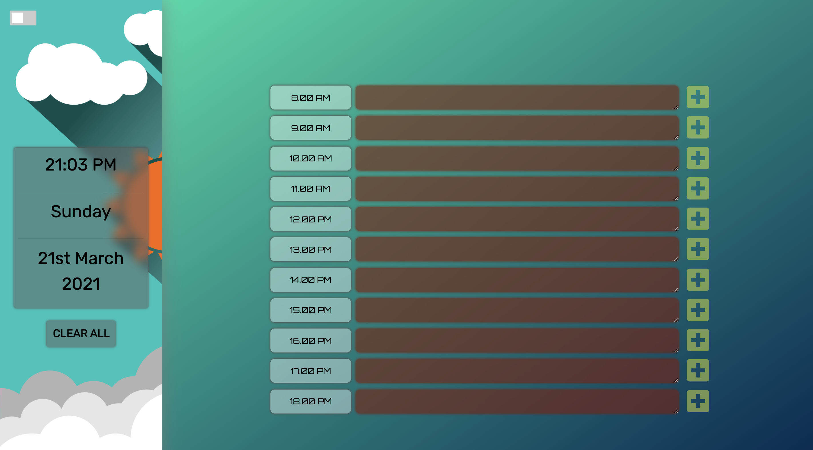

# 5-Daily-Planner

A web and mobile responsive daily work plannig application that allows users to save events for each working hour of the day. 

ability to add and save events to each time block by pressing the save button.

a clear all button will clear all saved data in local storage and reset the page.

